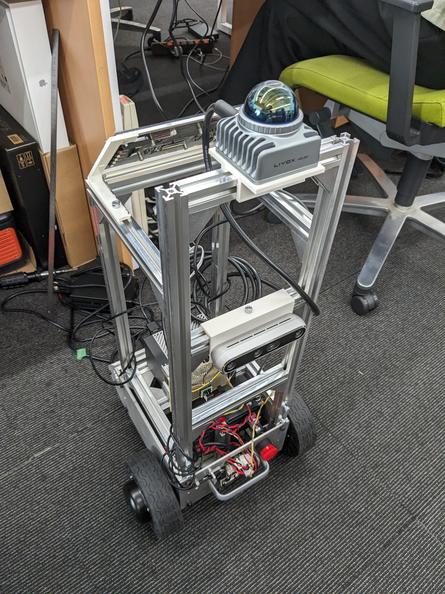
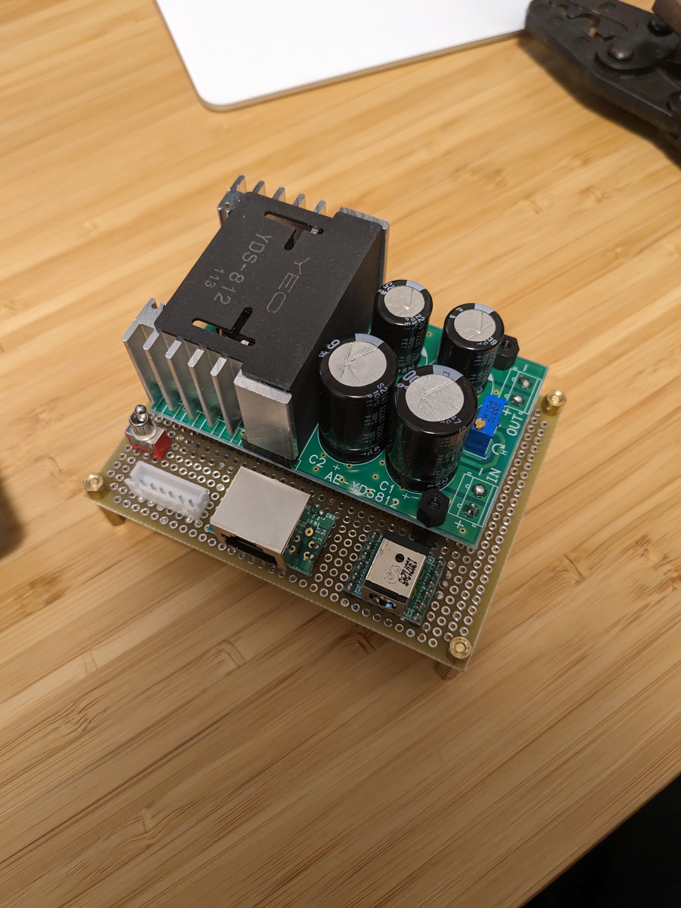

# ハードウェア
1. 車体: メガローバー ver3.0
1. PC: Jetson AGX Orin
1. Lidar: Livox Mid360
1. カメラ: Realsense D455
1. DCDCコンバータ: YDS-812

 

# ソフトウェア

1. clone
submoduleごとclone
```
git clone --recursive https://github.com/YasuChiba/megarover-ros2.git
```

1. build
```
cd workspace
colcon build
colcon build --cmake-args -DBUILD_TESTING=OFF
source install/setup.sh
pip3 install transforms3d
```

2. run

ホスト側で下記を実行
```
`xhost +local:` 
sudo chmod 777 /dev/video* 
```

必要に応じて以下をコンテナ内で実行
```
ros2 launch c_megarover msg_MID360_launch.py
ros2 launch c_megarover create_3dmap_launch.py rviz:=true
ros2 launch c_megarover create_2dmap_launch.py simulator:=false rviz:=false
ros2 launch c_megarover create_3dmap_rosbag_launch.py  rviz:=true rosbag_path:=/home/user/workspace/rosbag/rosbag2_2024_04_09-03_27_26
ros2 launch c_megarover create_3dmap_rosbag_launch.py  rviz:=true rosbag_path:=/home/user/workspace/rosbag/rosbag2_2024_04_10-01_35_06/ | grep -v "Failed to find match for fiel"

```

micro ros agentの開始.これを実行することで、車体側とROS2経由で通信が出来るようになる。    
dockerコンテナをUSB接続前から立ち上げていると制御基板がコンテナ内から見えないかも.  
permissionで怒られたら`sudo chmod 666 /dev/ttyUSB0`を実行。  
```
ros2 run micro_ros_agent micro_ros_agent serial --dev /dev/ttyUSB0 --baudrate 115200
```
見えるトピックは以下のはず  
- /rover_odo
- /rover_sensor
- /rover_twist


3. record/play

    ```
    ros2 bag record -a
    ros2 bag play hoge
    ```

4. export pcd
SLAMの結果の点群を、rosbagから取り出すには....
    ```
    ros2 run c_megarover_common pointcloud_to_pcd_node --ros-args -r input:=/Laser_map
    ```

## 3d and 2d map creation

1. record  
   `start_recording.sh`をコンテナ外から実行。もしくはコンテナ内で`ros2 launch c_megarover record_all_launch.py simulator:=false rviz:=true`を実行。
   `workspace/rosbag`にデータが格納。
1. slam
   1. 以下の２つをそれぞれ同時に実行
       - `ros2 launch c_megarover create_3dmap_launch_rosbag.py`
       - `ros2 bag play rosbag/rosbag_2024-xxxx/ --topics /livox/imu /livox/lidar`
   1. マッピングの終盤に以下を実行
       - `ros2 run c_megarover_common pointcloud_to_pcd_node --ros-args -p prefix:=/home/user/workspace/pcd/ -r input:=/Laser_map`
   1. pcdファイルが出力されたあとに以下を実行(出力のpgmファイルが変だったらthres_point_countつける。)
       - `ros2 run c_megarover_common pcd_to_occupancygrid_tool --ros-args -p pcd_file_path:=/home/user/workspace/pcd/1713279228.582533121.pcd -p output_file_path:=/home/user/workspace/maps/map2`
       - `ros2 run c_megarover_common pcd_to_occupancygrid_tool --ros-args -p pcd_file_path:=/home/user/workspace/maps/map2.pcd -p output_file_path:=/home/user/workspace/maps/map2 -p thres_point_count:=2`

## 2D navigation
コンテナ外で`start_2d_navigation.sh`を実行. 参照する地図を変える場合`workspace/container_entrypoints/start_2d_navigation.sh`を編集。


# memo

## Localization

1. run
    ```
    ros2 launch c_megarover 3d_localization_launch.py simulator:=true rviz:=true map_file_path:=/home/user/workspace/pcd/sendagi.pcd

    ros2 bag play rosbag/rosbag2_2024_04_12-03_10_57/ --topics /livox/lidar /livox/imu --clock
    ```
    `--clock` is required when the `simulator:=true`.
    

## Navigation  

1. run
    ```
    ros2 launch c_megarover navigation_launch.py simulator:=true rviz:=false map_file_path:=/home/user/workspace/maps/sendagi.pcd map_2d_file_path:=/home/user/workspace/maps/sendagi.yaml

    ros2 bag play rosbag/rosbag2_2024_04_12-03_10_57/ --topic /livox/imu /livox/lidar /rover_odo --clock
    ```

1. run(2d)  
    ```
    ros2 launch c_megarover 2d_localization_launch.py simulator:=true rviz:=true map_file_path:=/home/user/workspace/maps/sendagi.pcd map_2d_file_path:=/home/user/workspace/maps/sendagi.yaml
    ```


# memo

## slam_toolbox
slam_toolboxはodomが必須なので、create_2dmap_launch.pyはodomがある環境で試す。

## using realsense with jetson
(maybe) need to run ./setup_udev_rules.sh in librealsense2 on the host machine  
ros2 launch realsense2_camera rs_launch.py initial_reset:=true  
colcon build --cmake-args '-DBUILD_ACCELERATE_GPU_WITH_GLSL=ON'  


## ros2 run teleop_twist_keyboard teleop_twist_keyboard --ros-args --remap cmd_vel:=/rover_twist  
sudo apt-get install ros-humble-teleop-twist-keyboard

